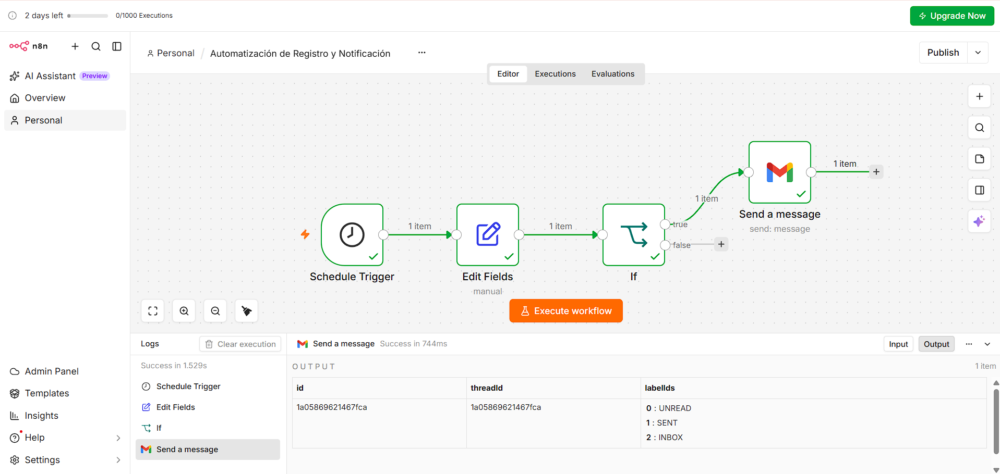

# Automatización de Reportes Diarios con n8n + Docker

## Objetivo

Construir una automatización funcional en **n8n**, corriendo en un contenedor de **Docker**, que genere y envíe automáticamente un reporte diario por correo electrónico. El desarrollo se gestionó de forma colaborativa a través de **GitHub**, usando la estrategia GitHub Flow con ramas individuales por integrante.

## Integrantes y roles

| Integrante | Rol |
|---|---|
| Belén | Infraestructura Docker |
| Liliana | Diseño del Workflow n8n y conexión Gmail |
| Luciana | Diseño del Workflow n8n y conexión Gmail |
| Cristhian | Pruebas y Documentación |

---

## 1. Instalación local (Docker)

### Requisitos
- Docker Desktop instalado y corriendo

### Pasos

1. Clonar el repositorio:
   ```
   git clone <url-del-repo>
   cd <nombre-del-repo>
   ```
2. Levantar el contenedor:
   ```
   docker compose up -d
   ```
3. Verificar que el contenedor esté corriendo:
   ```
   docker compose ps
   ```
4. Abrir el navegador en `http://localhost:5678`
5. La primera vez, n8n pide crear una cuenta de propietario (correo, nombre, apellido y contraseña). Con eso queda lista la instancia.
6. Para detener el contenedor:
   ```
   docker compose down
   ```

La persistencia de datos está garantizada por el volume `n8n_data`, configurado en el `docker-compose.yml`, así que el workflow no se pierde al reiniciar el contenedor.

---

## 2. Conexión de n8n con Gmail (OAuth 2.0)

Gmail no permite conectar una aplicación externa con solo usuario y contraseña; requiere autorización mediante **OAuth 2.0** a través de Google Cloud. Así se hizo la conexión:

```text
Google Cloud
    ↓
Crear proyecto
    ↓
Habilitar Gmail API
    ↓
Configurar pantalla de consentimiento OAuth
    ↓
Agregar cuenta como usuario de prueba
    ↓
Crear credenciales OAuth 2.0 (tipo Aplicación web)
    ↓
Configurar Redirect URI (la que entrega n8n)
    ↓
Copiar Client ID y Client Secret a n8n
    ↓
Autorizar la cuenta desde n8n
    ↓
Credencial "Gmail account" lista para usar
```

**Pasos:**

1. Entrar a [Google Cloud Console](https://console.cloud.google.com) y crear un proyecto nuevo.
2. Ir a **APIs y servicios → Biblioteca**, buscar **Gmail API** y habilitarla.
3. Ir a **APIs y servicios → Pantalla de consentimiento de OAuth**, elegir tipo **Externo** y completar los datos básicos de la app.
4. En **Test users**, agregar la cuenta de Gmail que se va a usar para enviar los correos.
5. Ir a **APIs y servicios → Credenciales → Crear credenciales → ID de cliente de OAuth**, tipo **Aplicación web**.
6. En n8n, al crear la credencial **Gmail OAuth2**, copiar la **Redirect URL** que muestra y pegarla en **Authorized redirect URIs** en Google Cloud.
7. Copiar el **Client ID** y **Client Secret** generados por Google y pegarlos en la credencial de n8n.
8. Autorizar la cuenta desde el botón de conexión: Google pide iniciar sesión y aceptar permisos.
9. n8n guarda la credencial como **Gmail account**, lista para usar en el nodo Gmail.

---

## 3. Workflow n8n
 
Se desarrollaron dos versiones del flujo:
 
### Versión 1
 
```text
🌐 Webhook
        ↓
   Procesamiento / Formato
        ↓
📧 Send a message (Gmail)
```
 
- **Webhook**: dispara el flujo mediante una petición externa (formulario o llamada HTTP).
- El resto del flujo formatea los datos recibidos y los envía por Gmail.
### Versión 2
 
```text
⏰ Schedule Trigger (21:00)
        ↓
📝 Edit Fields (genera el campo "Reporte")
        ↓
🔎 If (¿Reporte no está vacío?)
        ↓
📧 Send a message (Gmail)
```
 
- **Schedule Trigger**: se configura para que el flujo se ejecute automáticamente todos los días a una hora determinada (9:00 p. m.), disparando así el envío del reporte de forma diaria sin intervención manual.
- **Edit Fields**: arma el texto del reporte usando la fecha y hora que entrega el trigger (`$json["Readable date"]`, `$json["Readable time"]`).
- **If**: valida que el campo `Reporte` no esté vacío antes de continuar.
- **Send a message (Gmail)**: envía el reporte en formato HTML a la lista de destinatarios, usando la credencial Gmail OAuth2.

---

## 4. Datos de prueba

Se ejecutó el workflow manualmente antes de activarlo, revisando en cada nodo:

1. Que **Schedule Trigger** generara correctamente `Readable date` y `Readable time`.
2. Que **Edit Fields** construyera bien el campo `Reporte`.
3. Que **If** evaluara la condición como verdadera.
4. Que **Send a message** enviara efectivamente el correo a los destinatarios configurados.

---

## 5. Capturas de pantalla



---

## 6. Matriz de errores y soluciones

| # | Error encontrado | Causa | Solución |
|---|---|---|---|
| 1 | Al configurar `N8N_BASIC_AUTH_ACTIVE` en el `docker-compose.yml`, n8n no pedía usuario/contraseña como se esperaba, sino una pantalla de "Configurar la cuenta del propietario" | En versiones recientes de n8n, las variables `N8N_BASIC_AUTH_*` quedaron obsoletas y fueron reemplazadas por la creación de una cuenta de owner desde la interfaz | Se eliminaron esas variables del `docker-compose.yml` y se completó el registro directamente desde la pantalla de bienvenida de n8n |
| 2 | GitHub mostró el aviso "Your protected branch rules for your branch won't be enforced on this private repository until you move to a GitHub Team or Enterprise organization account" al configurar la protección de la rama `main` | Las reglas de protección de rama en repositorios privados no se aplican en el plan gratuito de GitHub | Se cambió el repositorio a público, en vez de aplicar el Student Developer Pack, y así la protección de rama sí se hizo efectiva sin costo. |
| 3 | La hora generada por el **Schedule Trigger** no coincidía con la hora real de Perú | La zona horaria del sistema/contenedor no estaba configurada correctamente y la hora de la PC estaba desactualizada | Se ingresó en modo administrador desde la consola y se ajustó la hora del sistema, configurando la zona horaria a la de Perú (`GENERIC_TIMEZONE=America/Lima` en el `docker-compose.yml`). Tras el ajuste, el resto del workflow funcionó correctamente |

---

## 7. Estructura del repositorio

```
├── Docs/
│   └── instalacion.md
├── workflows/
│   ├── Automatizacion_de_Resgistro_y_notificaciones.json 
    ├── Cambio_ScheduleTrigger.json
    ├── nueva_versiondeautomatizacion.json
    ├── workflow_01_trigger.json
│   └── workflow_02_procesamiento.json
├── .gitignore
├── README.md
└── docker-compose.yml
```